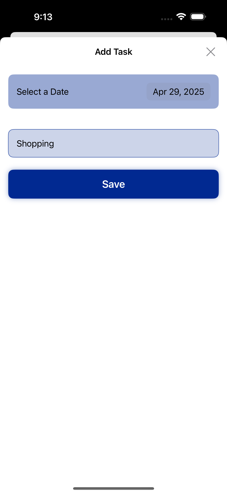
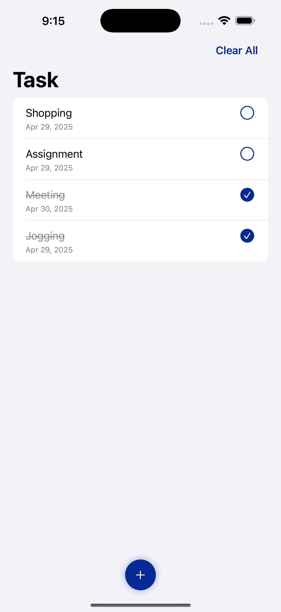

# ToDoApp

A simple To-Do list app built with SwiftUI and CoreData.

## Features
- Add, edit, and delete tasks
- Mark tasks as complete
- Local notifications for task reminders
- Data persistence using CoreData
- Dark Mode support

## Tools and Frameworks
- Swift 5
- SwiftUI
- CoreData
- UserNotifications

## Screenshots

## Installation
1. Clone the repo
2. Open `ToDoListApp.xcodeproj` in Xcode
3. Run on iOS Simulator or your device

## Future Improvements
- Add categories/tags for tasks
- Sync tasks with iCloud

